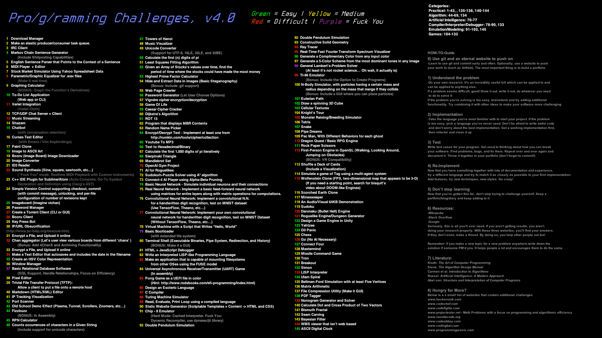

# Programming Challenges

This project is based on the below image from pro/g/ramming.

# Want to submit a challenge? Make a PR or an Issue!

## HOW-TO-Guide

### 0) Use git and external website to push on
Learn to use git an commit early and often. Optionally use a website to push your work to (such as GitHub). The most important thing is to build a portfolio.

### 1) Understand the problem
Do your own research. It's incredibly useful skill which can be applied to everything else. If a problem seems difficult, good! Draw it out, write it out, do whatever you need to do to solve it. If the problem you're solving is too easy, brainstorm and try adding additional functionality. Try combinding it with other ideas to make your software more challenging.

### 2) Implementation
Take the language you're more familiar with to start your project. If the problem is too easy, pick a language you've never used. Don't be afraid to write awful code and don't worry about the best implementation. Get a working implementation first, then refactor and clean it up.

### 3) Test
Write test cases for your program. Get used to thinking about how you can break your software. Find problems, bugs, and fix them. Repeat over and over again and document it. Throw together in your portfolio (don't forget to commit!)

### 4) Re-Implement
Now that you have something together with lots of documentation and experience, try a different language and try to match it as closely as possible to your first implementation. Add features, try new techniques, new styles. Go crazy!

### 5) Don't stop learning
Now that you've gotten this far, don't stop trying to challenge yourself. Keep a portfolio/blog/diary and keep adding to it.

### 6) Resources
- Wikipedia
- Stack Overflow
- Google

Seriously, this is all you'll ever need if you aren't getting results, you aren't doing your research properly. With these three websites, you'll find your answers. If they don't exist, make a thread. By doing so, you help other people out too!

Remember: If you make a new problem anywhere, write down the solution if someone PM'd you. It helps people a lot and encourages them to do the same.

### 7)
- Knuth: *The Art of Computer Programming*
- Siena: *The Algorithm Design Manual*
- Carmen et al: *Introduction to Algorithms*
- Russel: *Artificial Intelligence: A Modern Approach*
- Abel son: *Structure and Interpretation of Computer Programs*

### 8) Hungry for More?
Below is a small list of websites that contain additional challenges
- https://www.hackerrank.com
- https://www.codechef.com
- https://www.codefights.com
- https://www.projecteuler.net - Math Problems with a focus on programming and algorithmic efficiency
- https://www.rosettacode.org
- https://www.codeabbey.com
- https://www.codingbat.com
- https://www.programmingpraxis.com